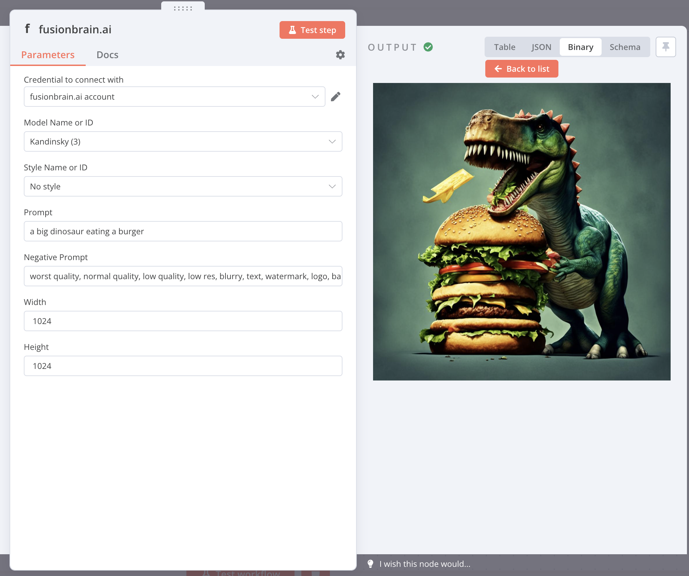
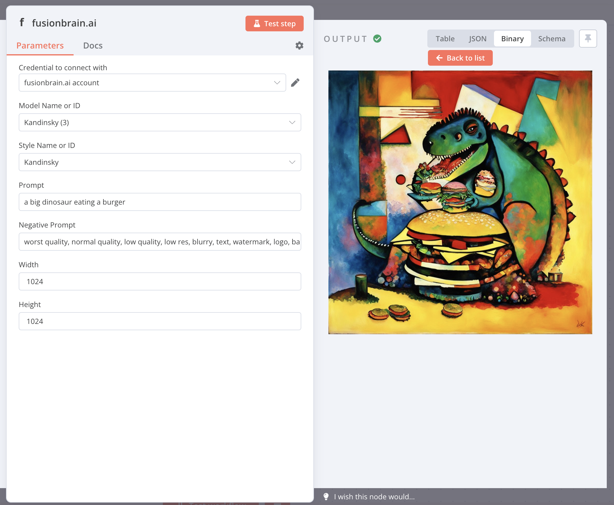
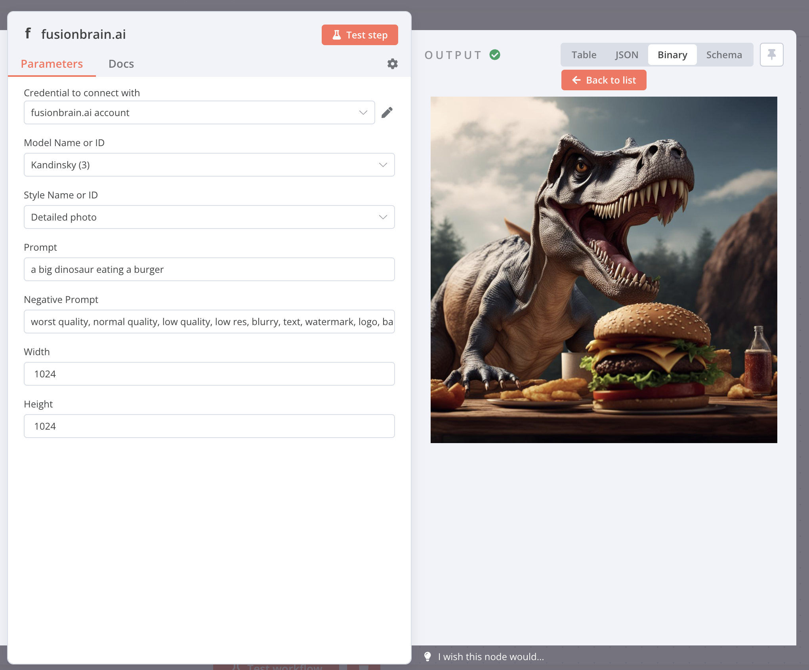
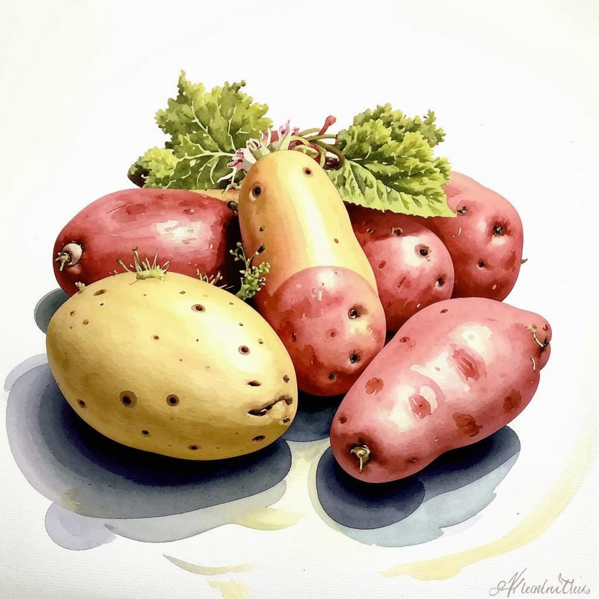
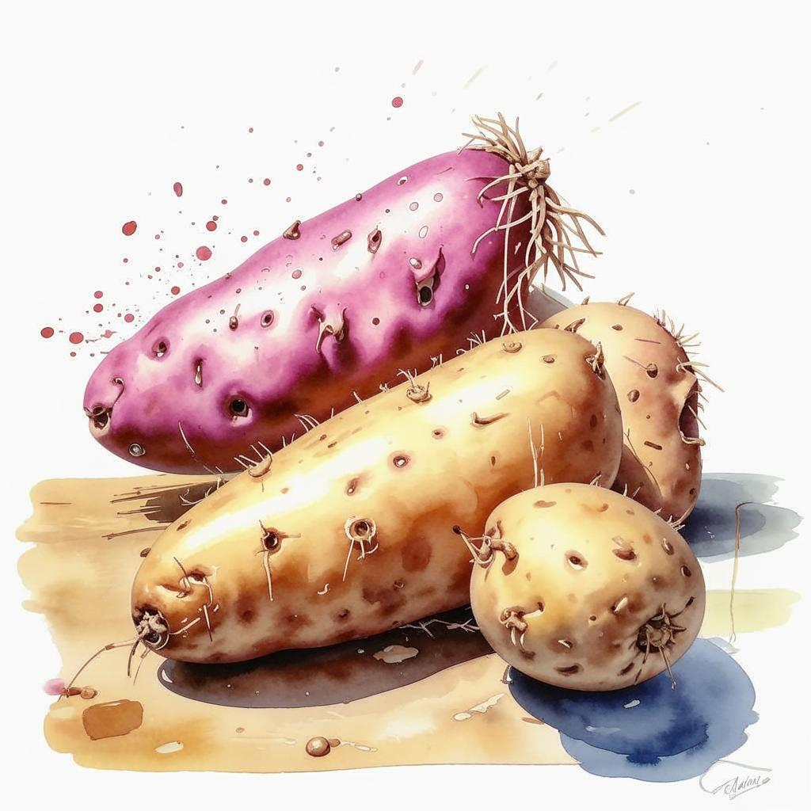
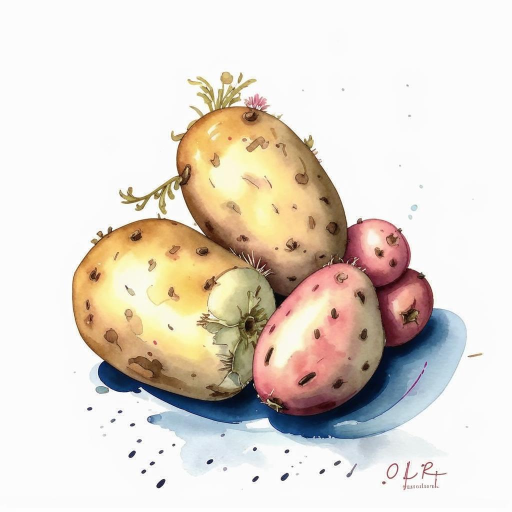
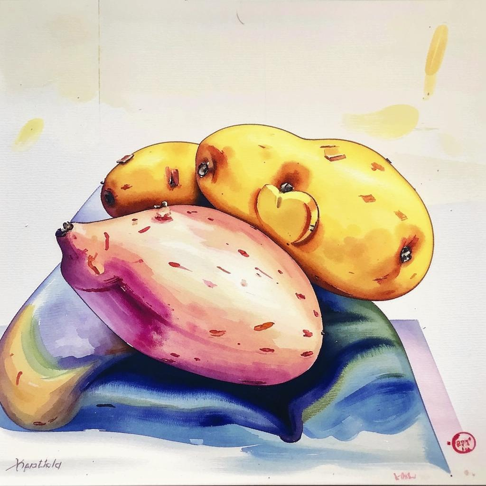

# n8n-nodes-fusionbrain

This is an n8n community node. It lets you use _fusionbrain.ai_ in your n8n workflows.

The fusionbrain.ai API offers a seamless solution for generating high-resolution images in JPG format, with resolutions
reaching up to 1024x1024 pixels, facilitating versatile applications across various domains from art to design.
Generation requests and images pass the appropriate censorship filters in accordance with our content policy, returning
an error when the request or image does not match.

[n8n](https://n8n.io/) is a [fair-code licensed](https://docs.n8n.io/reference/license/) workflow automation platform.

[Installation](#installation)  
[Operations](#operations)  
[Credentials](#credentials)  
[Usage](#usage)  
[Resources](#resources)

## Installation

Follow the [installation guide](https://docs.n8n.io/integrations/community-nodes/installation/) in the n8n community
nodes documentation.

1. Go to **Settings** > **Community Nodes**.
2. Select **Install**.
3. Enter **n8n-nodes-fusionbrain** in Enter npm package name.
4. Agree to the [risks](https://docs.n8n.io/integrations/community-nodes/risks/) of using community nodes: select **I
	 understand the risks of installing unverified code from a public source**.
5. Select Install.

After installing the node, you can use it like any other node. n8n displays the node in search results in the Nodes
panel.

## Operations

It supports these operations:

* **Text2Image**: Generates an image based on a given prompt and optional parameters like style and dimensions.
* **listModels**: Retrieves a list of available models that can be used for image generation.
* **listStyles**: Retrieves a list of available styles to customize the generated images.

## Credentials

Create a free fusionbrain.ai account [here](https://fusionbrain.ai/en/).

* Generate API keys here: [https://fusionbrain.ai/en/keys/](https://fusionbrain.ai/en/keys/)

## Usage

* **Model**: Select the text-to-image model to use.
* **Style**: Choose a style for the generated image (default: no style).
* **Prompt**: The main input text used to generate the image.
* **Negative Prompt**: (Optional) Specify elements to avoid in the generated image.
* **Width / Height**: Default is 1024 x 1024. It is recommended to use dimensions that are multiples of 64 for optimal
	results.

### Default Style

### Kandinsky Style

### Detailed Photo

## Test Results

This section displays the results of tests for each operation, based on a live n8n instance.

| Operation     | Last Tested                                        | Status                                              |
|---------------|----------------------------------------------------|-----------------------------------------------------|
| Text to Image | 2024-12-27  | ✅ Success  |
| List Models   | 2024-12-27 | ✅ Success |
| List Styles   | 2024-12-27 | ✅ Success |

### Created Images

**Prompt:**
<pre id="test-text2image-prompt">a water color painting of a potato,</pre>

**Images:**

| Model           | Style          | Image                                                                                                                             |
|-----------------|----------------|-----------------------------------------------------------------------------------------------------------------------------------|
| Kandinsky (3.1) | No Style       |                    |
| Kandinsky (3.1) | Detailed Photo |  |
| Kandinsky (3.1) | Anime          |                             |
| Kandinsky (3.1) | Kandinsky      |                 |

## Resources

* [n8n community nodes documentation](https://docs.n8n.io/integrations/community-nodes/)
* [fusionbrain.ai API Documentation](https://fusionbrain.ai/docs/en/doc/api-dokumentaciya/)
