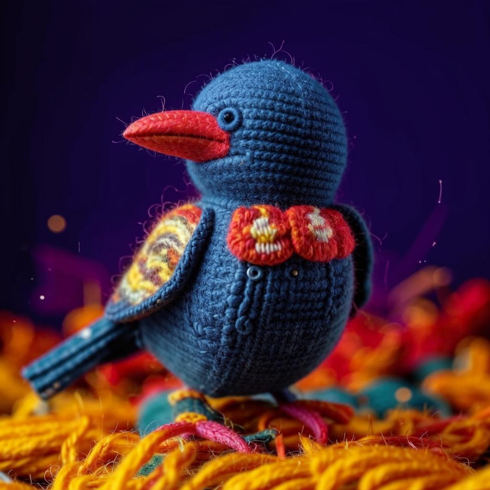

# n8n-nodes-fusionbrain

This is an n8n community node. It lets you use _fusionbrain.ai_ in your n8n workflows.

The fusionbrain.ai API offers a seamless solution for generating high-resolution images in JPG format, with resolutions reaching up to 1024x1024 pixels, facilitating versatile applications across various domains from art to design.
Generation requests and images pass the appropriate censorship filters in accordance with our content policy, returning an error when the request or image does not match.

[n8n](https://n8n.io/) is a [fair-code licensed](https://docs.n8n.io/reference/license/) workflow automation platform.

[Installation](#installation)  
[Operations](#operations)  
[Credentials](#credentials)  
[Usage](#usage)  
[Resources](#resources)  

## Installation

Follow the [installation guide](https://docs.n8n.io/integrations/community-nodes/installation/) in the n8n community nodes documentation.
1. Go to **Settings** > **Community Nodes**.
2. Select **Install**.
3. Enter **n8n-nodes-fusionbrain** in Enter npm package name.
4. Agree to the [risks](https://docs.n8n.io/integrations/community-nodes/risks/) of using community nodes: select **I understand the risks of installing unverified code from a public source**.
5. Select Install.

After installing the node, you can use it like any other node. n8n displays the node in search results in the Nodes panel.

## Operations

It supports these operations:
* Text2Image Generation 

## Credentials

Create a free fusionbrain.ai account [here](https://fusionbrain.ai/en/).

* Generate API keys here: [https://fusionbrain.ai/en/keys/](https://fusionbrain.ai/en/keys/)

## Usage

* model: choose the text 2 image model to use 
* style: choose the style to use (default: no style)
* prompt: the text 2 image prompt
* negative_prompt: the text 2 image negative prompt (optional)
* width / height: default 1024 x 1024, (it is recommended to use multiples of 64 on each side for better results.)

### Default Style

### Kandinsky Style

### Detailed Photo

## Test Results

This section displays the results of tests for each operation, based on a live n8n instance.

| Operation     | Last Tested                                       | Status                                             | Result                                                                                |
|---------------|---------------------------------------------------|----------------------------------------------------|---------------------------------------------------------------------------------------|
| Text to Image | 2024-12-01 | ✅ Success |  |

## Resources

* [n8n community nodes documentation](https://docs.n8n.io/integrations/community-nodes/)
* [fusionbrain.ai API Documentation](https://fusionbrain.ai/docs/en/doc/api-dokumentaciya/)
